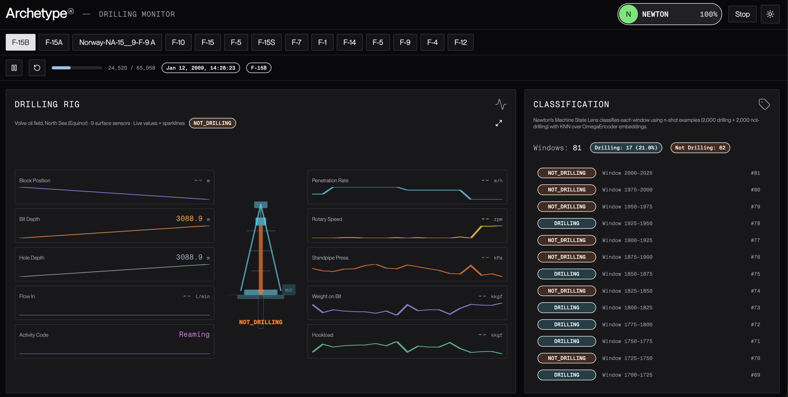

# Newton Drilling Monitor

Drilling state classification dashboard powered by [Newton](https://www.archetypeai.dev/) and the [Equinor Volve Data Village](https://www.equinor.com/energy/volve-data-sharing).

Plays back real drilling sensor data from 14 wells in the Volve oil field (North Sea, 2007–2009 drilling phase) and uses Newton's Machine State Lens to classify each data window as **drilling** or **not_drilling** in real-time via SSE streaming. Includes live evaluation against ACTC ground truth.

> The Volve field operated 2007–2016, but real-time drilling sensor data only covers the 2007–2009 construction phase. After 2009 the rig left and the field moved to production (different file types, no real-time WITSML streams).



## Features

- **14 wells** from the Volve North Sea oil field, sorted by drilling activity percentage
- **Rig instrument panel** — SVG drilling rig with 10 live sensor sparklines (9 channels + ACTC ground truth)
- **Playback controls** — play, pause, reset with progress bar, human-friendly timestamps
- **Machine State classification** — Newton classifies each 64-sample window as drilling or not_drilling
- **Classification log** — scrolling list of predictions with drilling/not-drilling counts
- **N-shot learning** — 2,000 labeled examples per class (from batch repo, seed 42) uploaded to Newton for KNN
- **SSE streaming** — results arrive in real-time as windows are processed
- **Incremental data loading** — full raw CSVs (up to 1.9M rows) loaded in 5,000-row chunks during playback

### Advanced Mode (⚙)

- **Live Evaluation** — compares predictions against ACTC ground truth (unanimous windows only), shows accuracy, F1, precision, recall, confusion matrix, and per-window pass/fail log

## Tuning the Config

Hyperparameter search lives in a separate tool: [archetypeai/newton-streaming-optimizer](https://github.com/archetypeai/newton-streaming-optimizer) brute-forces a grid of window sizes / KNN params against the streaming API and outputs a ready-to-use config JSON. Drop the winning values into `DEFAULT_CONFIG` in `src/lib/server/newton.js` to apply them here.

## Notes on the Streaming Encoder

The streaming API uses `OmegaEncoder::omega_embeddings_01` (generic time-series encoder). Macro F1 around 85% is achievable with well-chosen n-shot examples and a balanced inference slice (see the streaming optimizer results). The batch pipeline's `omega_1_3_surface` (domain-specific surface drilling encoder) achieves higher accuracy but is not yet available for the streaming/lens API.

## Stack

- **SvelteKit** with Svelte 5 runes
- **Archetype AI Design System** — semantic tokens, component primitives, composite patterns
- **Newton Machine State Lens** — `lens_timeseries_state_processor` with OmegaEncoder embeddings + KNN
- **SSE** — Server-Sent Events for real-time classification results
- **Tailwind v4** — styling with semantic design tokens

## Dataset

The [Equinor Volve Data Village](https://www.equinor.com/energy/volve-data-sharing) provides real-time drilling sensor data from the Volve oil field. 9 sensor channels at ~1-second resolution:

| Channel | Description | Unit |
|---------|-------------|------|
| BPOS | Block Position | m |
| DBTM | Bit Depth | m |
| FLWI | Flow In | L/min |
| HDTH | Hole Depth | m |
| HKLD | Hookload | kkgf |
| ROP | Rate of Penetration | m/h |
| RPM | Rotary Speed | rpm |
| SPPA | Standpipe Pressure | kPa |
| WOB | Weight on Bit | kkgf |

**Drilling** (ACTC 1-2) = bit on bottom, rotating, mud flowing, hole getting deeper. **Not drilling** (ACTC 3/4/8/9) = tripping, circulating, shut in, etc.

## Setup

```bash
npm install
```

Create a `.env` file:

```
ATAI_API_KEY=your_api_key_here
ATAI_API_ENDPOINT=https://api.u1.archetypeai.app/
```

## Development

```bash
npm run dev
```

Open `http://localhost:5173`, select a well, click **Start Analysis**, then press Play.

## How It Works

1. Select a well — data loads incrementally from full raw CSVs (up to 1.9M rows per well)
2. **Start Analysis** uploads n-shot CSV files (2,000 drilling + 2,000 not_drilling), creates a Machine State Lens session, and connects SSE
3. Press **Play** — data plays back at accelerated speed, advancing the rig sparklines and playhead
4. As the playhead passes each 64-sample window boundary, the window is streamed to Newton
5. Newton computes OmegaEncoder embeddings, runs KNN against n-shot examples, returns classification via SSE
6. Results appear as colored bands on the rig and entries in the classification log

## Architecture

```
src/
├── routes/
│   ├── +page.svelte                  # Dashboard orchestrator
│   └── api/
│       ├── session/+server.js        # Newton lens session lifecycle (SSE progress)
│       ├── wells/+server.js          # List wells sorted by drilling %
│       ├── wells/data/+server.js     # Paginated well data chunks
│       ├── stream/+server.js         # Stream data windows to Newton
│       └── sse-proxy/+server.js      # Proxy Newton SSE to browser
├── lib/
│   ├── server/newton.js              # Machine State Lens API (DEFAULT_CONFIG)
│   ├── api/drilling.js               # Client-side fetch wrappers
│   └── components/ui/custom/
│       ├── rig-dashboard.svelte      # SVG rig + 10 sensor sparklines
│       ├── classification-log.svelte # Prediction history + stats
│       ├── accuracy-panel.svelte     # Live Evaluation (accuracy, F1, confusion matrix)
│       ├── playback-controls.svelte  # Play/pause/reset + progress
│       └── well-selector.svelte      # Well button grid
└── static/data/
    ├── volve_drilling.csv            # N-shot examples (2,000 drilling rows)
    ├── volve_not_drilling.csv        # N-shot examples (2,000 not-drilling rows)
    └── wells/                        # 14 full raw well CSVs (Git LFS)
```

## Newton API Pattern

This demo uses the **Machine State Lens** — the third Newton API pattern:

| Pattern | Used In | API |
|---------|---------|-----|
| Vision (lens session + model.query) | Traffic, Wildfire | Image → classification |
| Text reasoning (direct query) | Earthquake, Grid | Structured text → analysis |
| **Machine State (lens session + SSE)** | **Drilling** | **Time-series → state classification** |

## Newton Config

```json
{
  "model_name": "OmegaEncoder",
  "model_version": "OmegaEncoder::omega_embeddings_01",
  "normalize_input": true,
  "buffer_size": 64,
  "csv_configs": {
    "timestamp_column": "DATE_TIME",
    "data_columns": ["BPOS", "DBTM", "FLWI", "HDTH", "HKLD", "ROP", "RPM", "SPPA", "WOB"],
    "window_size": 64,
    "step_size": 64
  },
  "knn_configs": {
    "n_neighbors": 5,
    "metric": "euclidean",
    "weights": "uniform",
    "algorithm": "ball_tree"
  }
}
```

## Data Attribution

The drilling sensor data used in these examples is from the **Equinor Volve Data Village**, released under a modified CC BY 4.0 license. The data may be used for commercial and non-commercial purposes but may not be resold.

> Data provided by Equinor and the former Volve license partners (ExxonMobil Exploration & Production Norway AS and Bayerngas Norge AS). [Terms and Conditions](https://www.equinor.com/energy/volve-data-sharing).
